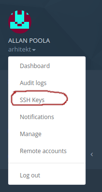

## Juhend tegevusteks

Igale kasutajale on jagatud paber tema kasutajanime ja parooliga
1. Kasutades oma arvutis olevaid tööriistu, logi sisse masinasse 171.22.247.103
```shell
ssh <kasutajanimi>@171.22.247.103
 ```
2. kontrolli, kas ansible on olemas ja töötab:
```shell
ansible -version
```
3. Selleks, et Riigipilves ligi pääseda masinatele, mida sa oled loonud, on sul vaja panna kaasa on avalik võti,
mida sa kasutad sisselogimiseks. Selleks on kõigepealt vaja genereerida `ssh` võtmepaar:
```shell
ssh-keygen -b 2048 -t rsa
```
4. Logi sisse Riigipilve iseteenindusportaali - https://riigipliv.ee, ja impordi oma avalik võti enda
profiili alla. Selleks kuva oma avalik võti konsoolis,
```shell
cat cat ~/.ssh/id_rsa.pub
```
copy kuvatud võti clipboard -i ja pasteeri see Riigipilve iseteenindusportaali:



5. Lae alla Ansible nädisprojekt:
```shell
git clone --depth 1 https://github.com/riigipilv/ansible-demo.git
```
6. Asume uurima Ansible projekti struktuuri
